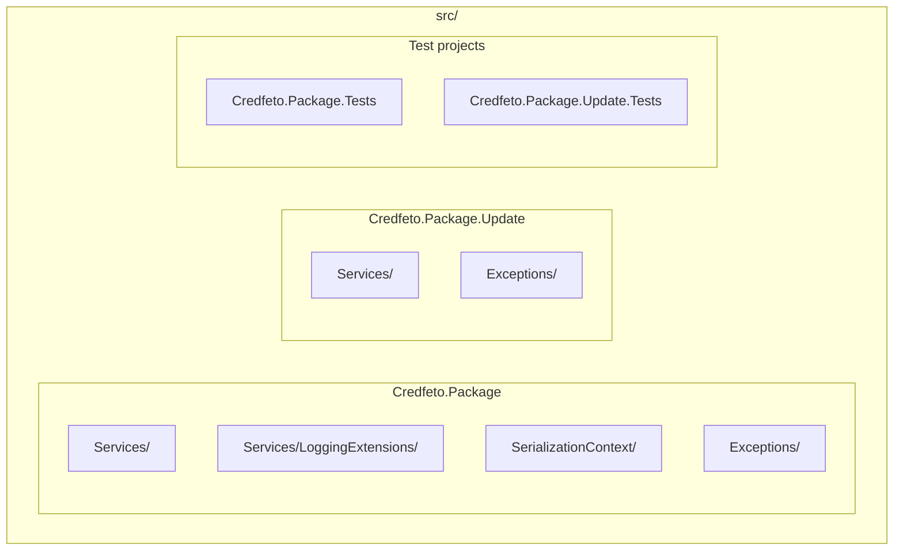
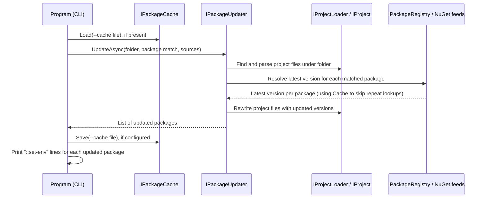

# Architecture

## Overview

`credfeto-dotnet-package-update` is split into two projects: a reusable library that contains all the
package-resolution and project-rewriting logic, and a thin CLI that parses arguments and drives the
library. The CLI has no NuGet or project-file logic of its own; everything reusable lives in the
library so it could be hosted by a different front end without change.

## Folder structure

- **`Credfeto.Package`**: the class library. Defines the core abstractions (`IPackageCache`,
  `IPackageMetadataFetcher`, `IPackageRegistry`, `IPackageUpdater`, `IProject`, `IProjectLoader`) and
  their implementations under `Services/`, structured logging extensions under
  `Services/LoggingExtensions/`, source-generated JSON serialisation for the cache file under
  `SerializationContext/`, and library-specific exceptions under `Exceptions/`.
- **`Credfeto.Package.Update`**: the CLI entry point (packaged as the `updatepackages` global tool).
  Contains argument parsing (`Options.cs`), DI container setup (`ApplicationSetup.cs`), a diagnostic
  logger under `Services/` that tracks whether an error occurred (for exit-code purposes), and
  CLI-specific exceptions under `Exceptions/`.

## Data flow

1. `Program` parses CLI options and builds a `PackageUpdateConfiguration` (the package match plus any
   exclusions).
2. If `--cache` points at an existing file, `IPackageCache` loads previously resolved versions so
   repeated runs avoid redundant NuGet lookups.
3. `IPackageUpdater` walks the target folder for project files, checks each matched package against
   the configured NuGet feeds via `IPackageRegistry`/`IPackageMetadataFetcher`, and rewrites any
   project file that references an outdated version.
4. The cache is saved back to disk (if configured), and the CLI prints one line per updated package.

There is no git or source-control integration inside the tool itself: committing, branching, and
changelog updates are the responsibility of the calling script or CI pipeline, not this codebase.

## Related documentation

- [README.md](../README.md) for installation and usage.
- [CHANGELOG.md](../CHANGELOG.md) for release history.
